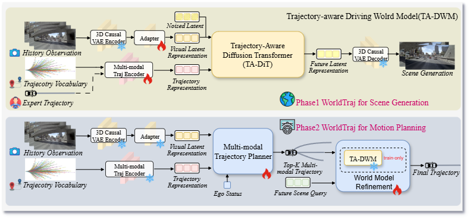

<div align="center">

<h1>WorldTraj</h1>

<h3 align="center">Driving with World Model via Unifying Visual and Trajectory Representation</h3>

Xingtai Gui<sup>1</sup>, Meijie Zhang<sup>2</sup>, Tianyi Yan<sup>1</sup>, Wencheng Han<sup>1</sup>, Jiahao Gong<sup>3</sup>, Feiyang Tan<sup>3</sup>, Cheng-zhong Xu<sup>1</sup>, Jianbing Shen<sup>1</sup>  <br>
> 
<sup>1</sup>SKL-IOTSC, CIS, University of Macau, <sup>2</sup>MEGVII Technology, <sup>3</sup>Mach Drive

<a href="https://arxiv.org/pdf/2512.00723">
</a>
<a href="https://huggingface.co/tabguigui/WorldTraj">
    
</a>
<a href="https://opensource.org/licenses/Apache-2.0">
    
</a>

</div>

---

## News
**[2026.2.3]** Release the WorldTraj Project! 

## Updates

- [x] Release TA-DWM weights
- [x] Release Multi-modal planner weights
- [] Release Planner with Refinement weights
- [] Release the Paper

## Table of Contents
- [News](#news)
- [Updates](#updates)
- [Table of Contents](#table-of-contents)
- [Abstract](#abstract)
- [Overview](#overview)
- [Getting Started](#getting-started)
- [Training and Evaluation](#training-and-evaluation)
- [Contact](#contact)
- [Acknowledgement](#acknowledgement)
- [Citation](#citation)

--- 
## Abstract
End-to-end autonomous driving aims to generate safe and plausible planning policies from raw sensor input, and constructing an effective scene representation is a critical challenge. Driving world models have shown great potential in learning rich representations for end-to-end planning by predicting the future evolution of a driving scene. However, a schism remains between the optimization of visual scene generation and the requirements of precise motion planning. To bridge this gap, we present WorldTraj: driving with world model via unifying visual and trajectory representation. We first introduce a Trajectory-aware Driving World Model, which conditions on a predefined trajectory vocabulary to enforce the consistency between visual dynamics and motion intentions. Leveraging a strategy of representation inheritance, we transfer the physically aligned vision and trajectory encoders to a downstream lightweight Multi-modal Planner, ensuring the driving policy operates on mature representations pre-optimized by future scene generation. A simple interaction between trajectory representation, visual representation, and ego-status can generate high-quality, multi-modal trajectories. Furthermore, to exploit the world model’s foresight, we propose a World Model Refinement module, which distills future latent representation from the frozen world model to evaluate and select optimal trajectories in real-time. Extensive experiments demonstrate that WorldTraj achieves state-of-the-art planning performance while maintaining high-fidelity action-controlled video generation capabilities, validating the effectiveness of unifying visual and trajectory representations for robust autonomous driving.

---
## Overview

<div align="center">

</div>


## Getting Started

---

We provide detailed guides to help you quickly set up, and evaluate WorldTraj:

- [Getting started from NAVSIM environment preparation](https://github.com/autonomousvision/navsim?tab=readme-ov-file#getting-started-)
- [Preparation of WorldTraj environment](docs/Installation.md)
- [WorldTraj Training and Evaluation](docs/Train_Eval.md)

## Training and Evaluation

### Stage 1: Trajectory-aware Driving World Model pretrain *(Optional)*

> ⚠️ This stage is optional since a long time training.  
> You may skip it and directly use our released TA-DWM checkpoint.

#### Step 1: Download pretrained WM checkpoint

First you need to download the pretrained wm checkpoint training on nuPlan(*cogvideox_2B_tadwm_stage1_pretrain*) \
👉 [Model](https://huggingface.co/tabguigui/WorldTraj/tree/main)


#### Step 2: Configure training script
After downloading, go to `/data/worlddrive/navsim/scripts/training_wm/tadwm_stage2.sh` configure the training script.

Launch the training process:
```bash
cd /data/worlddrive/navsim/scripts/training_wm/
sh .tadwm_training.sh
```


### Stage 2: Multi-modal Planner Training

Stage 2 consists of three steps:

1. Cache dataset
2. Download TA-DWM checkpoint
3. Train planner

#### Step1: cache dataset(3D causal VAE latents)
You need to download the pretrained 3D Causal VAE from offical CogvideoX-2B HF\
👉 [CogvideoX-2B VAE](https://huggingface.co/zai-org/CogVideoX-2b/tree/main)

You need to download the anchor and corresponding formated PDMS\
👉 [Anchors](https://huggingface.co/tabguigui/WorldTraj/tree/main)

go to `scripts/cache/run_caching_trajworld.sh` configure the training script.

Launch the multi-gpu data cache process(takes about 4hs with 8 GPUs):
```bash
sh scripts/cache/run_caching_trajworld.sh # navtrain
sh scripts/cache/run_caching_trajworld_eval.sh # navtest for eval
```

#### Step2: download ta-dwm checkpoint
You can download the corresponding ta-dwm checkpoint training on NAVSIM (*worldtraj_stage1_1024_tadwm*) or use the checkpoint training from Stage 1. \
👉 [TA-DWM Model](https://huggingface.co/tabguigui/WorldTraj/tree/main)

#### Step3: train planner
go to `scripts/cache/run_caching_trajworld.sh` configure the training script.

Launch the multi-gpu training process:
```bash
sh scripts/training/run_worldtraj_planner.sh
```

#### Step4: evaluate planner
go to `scripts/evaluation/run_worlddrive_planner_pdm_score_evaluation_stage1.sh` configure the evaluation script.

Launch the multi-gpu evaluation process:
```bash
sh scripts/evaluation/run_worlddrive_planner_pdm_score_evaluation_stage1.sh
```

## Stage 3: World Model Alignment and Refinement

#### Step1: evaluate worldtraj
go to `scripts/evaluation/run_worlddrive_planner_pdm_score_evaluation_stage2.sh` configure the evaluation script.

Launch the multi-gpu evaluation process:
```bash
sh scripts/evaluation/run_worlddrive_planner_pdm_score_evaluation_stage2.sh
```

#### Step2: visulize worldtraj

## Contact
If you have any questions, please contact Xingtai via email (tabgui324@gmail.com)

## Acknowledgement
We thank the research community for their valuable support. WorldTraj is built upon the following outstanding open-source projects: \
[diffusers](https://github.com/huggingface/diffusers) \
[WoTE](https://github.com/liyingyanUCAS/WoTE)(End-to-End Driving with Online Trajectory Evaluation via BEV World Model (ICCV2025)) \
[Epona](https://github.com/Kevin-thu/Epona)(Epona: Autoregressive Diffusion World Model for Autonomous Driving) \
[Recogdrive](https://github.com/xiaomi-research/recogdrive)(A Reinforced Cognitive Framework for End-to-End Autonomous Driving) \
 
## Citation
If you find TrajDiff is useful in your research or applications, please consider giving us a star 🌟.
